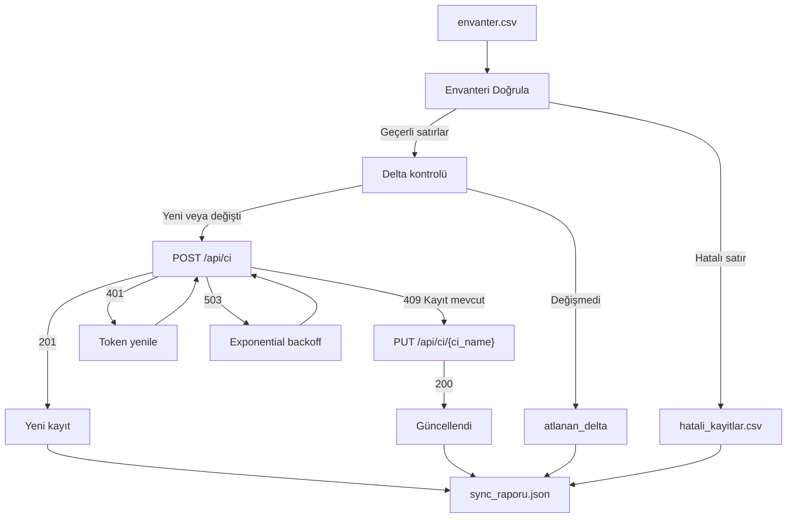

# Sync Motoru — CSV -> CMDB Entegrasyonu

**KONSALT Staj Programı 2026 · Challenge 7**  
Seviye: Orta · Stack: Python 3 · Ön koşullar: [Challenge 3](https://github.com/beyzayilmaz1/konsalt_challenge03_apikasifi) ve [Challenge 6](https://github.com/beyzayilmaz1/konsalt-challenge-06-mini-envanter-api)

Bu proje, müşterinin CSV envanterini merkezi bir CMDB API'sine güvenilir şekilde aktaran bir **sync aracı**dır. Amaç yalnızca veri göndermek değil; kirli veriyi ayırmak, token süresi ve geçici servis hatalarıyla başa çıkmak, tekrar çalıştırmalarda veri şişirmeyen idempotent bir akış kurmaktır.

---

## Proje Özeti

| Başlık | Açıklama |
|-------|----------|
| **Problem** | `envanter.csv` içindeki kayıtları huysuz bir hedef API'ye eksiksiz ve güvenilir şekilde aktarmak |
| **Girdi** | `envanter.csv` - sunucu, uygulama ve ağ cihazı envanteri |
| **Çıktı** | `hatali_kayitlar.csv`, `sync_raporu.json`, isteğe bağlı `sync_state.json` ve `sync.log` |
| **Zorluklar** | Kirli veri, 60 sn token ömrü, rastgele `503`, tekrar `POST` için `409` |
| **Çözüm** | Doğrulama katmanı + merkezi API istemcisi + retry + idempotent upsert |
| **Bonuslar** | `--dry-run`, delta sync, loglama, performans metrikleri, CI |

---

## Ne Yapar?

`sync.py` çalıştığında akışın özeti şöyledir:

1. `envanter.csv` okunur.
2. Her satır API'ye gitmeden önce doğrulanır.
3. Hatalı satırlar `hatali_kayitlar.csv` dosyasına sebebiyle yazılır.
4. Geçerli satırlar hedef API'ye gönderilir.
5. `401` alınırsa token yenilenir ve istek tekrar edilir.
6. `503` alınırsa exponential backoff ile yeniden denenir.
7. `409` alınırsa kayıt zaten vardır; `PUT` ile güncellenir.
8. Süreç sonunda `sync_raporu.json` yazılır ve özet konsola basılır.

Bu sayede her satırın akıbeti bellidir: ya elenir, ya eklenir, ya güncellenir, ya da kalıcı hata olarak raporlanır.

---

## Hızlı Başlangıç

```bash
pip install -r requirements.txt
```

### 1. Hedef API'yi başlat

```bash
python hedef_api.py
```

API varsayılan olarak `http://127.0.0.1:5050` üzerinde çalışır. Beklenen endpoint davranışları `hedef_api.py` dosyasının başındaki açıklamalarda yer alır.

### 2. Sync'i çalıştır

```bash
python sync.py
```

Başarılı bir çalışma sonunda:

- konsolda özet tablo görülür
- `hatali_kayitlar.csv` oluşur
- `sync_raporu.json` oluşur
- log kayıtları `sync.log` dosyasına yazılır

---

## Doğrulama Senaryosu

Temel akışı doğrulamak için önerilen sıra:

1. `python hedef_api.py`
2. `python sync.py`
3. `python sync.py` komutunu ikinci kez çalıştır
4. `python sync.py --no-delta` ile idempotent güncelleme yolunu doğrula
5. `hatali_kayitlar.csv` ve `sync_raporu.json` dosyalarını incele

Sabit kalan sayaçlar (her çalışmada aynı):

- `okunan=38`, `elenen=6`
- ilk çalışma (temiz API): `eklenen=32`, `guncellenen=0`
- ikinci çalışma, delta açık: `atlanan_delta=32`
- üçüncü çalışma, `--no-delta`: `guncellenen=32`
- tüm koşullarda: `denge_kontrolu=true`

Çalıştırmaya bağlı değişen alanlar:

- `retry_sayisi` — API rastgele `%10` olasılıkla `503` döndürdüğü için her koşuda farklı olabilir
- `eklenen` / `guncellenen` — API'de kayıtlar zaten varsa ilk çalışmada bile `409 → PUT` yolu devreye girer ve `guncellenen` artabilir
- `token_alma_sayisi`, `api_istek_sayisi`, süre ve ms metrikleri

---

## Örnek Çıktılar

> **Not:** Repodaki `sync_raporu.json`, temiz API üzerindeki **ilk çalıştırma** çıktısıdır (`eklenen=32`, `guncellenen=0`). `retry_sayisi` ve süre metrikleri çalıştırmaya göre değişebilir.

İlk çalışmada beklenen özet (alan etiketleri sabittir; `Retry`, süre ve API ms değerleri çalıştırmaya göre değişebilir):

```text
========================================================
  SYNC OZETI
========================================================
  Okunan satir        : 38
  Elenen (dogrulama)  : 6
  Yeni eklenen        : 32
  Guncellenen         : 0
  Delta atlanan       : 0
  Kalici hata         : 0
  Retry sayisi        : 5
  Token alma sayisi   : 1
  API istek sayisi    : 38
  Toplam sure (sn)    : 5.507
  Ortalama API (ms)   : 12.96
  En hizli API (ms)   : 3.85
  En yavas API (ms)   : 32.37
  Denge kontrolu      : OK
========================================================
```

> Konsol alan adları ASCII tutulmuştur ve `sync.py` içindeki `_print_summary` çıktısıyla aynıdır.

İkinci çalışmada delta sync açıkken örnek `sync_raporu.json` özeti:

```json
{
  "okunan": 38,
  "elenen": 6,
  "eklenen": 0,
  "guncellenen": 0,
  "atlanan_delta": 32,
  "kalici_hata": 0,
  "retry_sayisi": 0,
  "token_alma_sayisi": 0,
  "api_istek_sayisi": 0,
  "denge_kontrolu": true
}
```

`hatali_kayitlar.csv` içinden örnek satırlar (gerçek çıktıyla aynı sebep metinleri):

```csv
ci_name,ci_type,ip_address,os,owner_email,ram_gb,location,satir_no,sebep
IST-WEB01,server,10.30.2.5,Ubuntu 22.04,ali.c@konsalt.example,16,Istanbul-DC,34,birebir_tekrar_eden_satir
ist-web02,Server,10.30.2.6,ubuntu 22.04,ALI.C@konsalt.example,16,istanbul-dc,35,buyuk_kucuk_harf_farkiyla_duplicate_ci_name (ilk_satir:5)
ANKARA-DB02,server,10.20.1.999,RHEL 9,mehmet.y@konsalt.example,64,Ankara-DC,36,gecersiz_ip_adresi:'10.20.1.999'
TEST-BOX,server,10.20.9.77,CentOS 7,not-an-email,abc,Ankara-DC,37,bozuk_e_posta:'not-an-email'; ram_gb_sayisal_olmalı:'abc'
```

Bu üç artefakt birlikte incelendiğinde:

- hangi satırların reddedildiği
- hangi kayıtların başarıyla işlendiği
- kaç retry gerektirdiği
- toplam sayım dengesinin bozulup bozulmadığı

tek bakışta görülebilir.

---

## Mimari

```text
envanter.csv
    |
    v
[Doğrulama Katmanı] ------> hatali_kayitlar.csv
    |
    v
[Delta Kontrolü]
    |
    v
[CmdbClient.api_istek()]
    |-- POST /api/token
    |-- POST /api/ci
    |-- 401 -> token yenile -> tekrar
    |-- 503 -> retry (1s, 2s, 4s)
    |-- 409 -> PUT /api/ci/{ci_name}
    v
sync_raporu.json + sync_state.json + sync.log
```

---

## Akış Diyagramı



---

## Doğrulama Kuralları

Her satır API'ye gitmeden önce kontrol edilir. Geçersiz kayıtlar sessizce yutulmaz; ayrı bir dosyada sebepleriyle saklanır.

| Kural | Açıklama | CSV'deki örnek |
|------|----------|----------------|
| Zorunlu alan | `ci_name`, `ci_type`, `location` boş olamaz | boş `ci_name` olan satır |
| `ci_type` enum | Yalnızca `server`, `application`, `network_device` kabul edilir | `storage` |
| IP doğrulama | Doluysa `ipaddress.ip_address()` ile kontrol edilir | `10.20.1.999` |
| E-posta formatı | Doluysa temel e-posta formatına uymalı | `not-an-email` |
| `ram_gb` sayısal alan | Boş olabilir; doluysa tam sayı olmalı | `abc` |
| Birebir duplicate | Tüm kolonları aynı olan tekrar satır reddedilir | ikinci `IST-WEB01` |
| Case-insensitive duplicate | `ci_name.strip().upper()` ile tekrar kontrol edilir | `ist-web02` ve `IST-WEB02` |

**Beklenen dağılım:** toplam `38` satırdan `6` geçersiz, `32` geçerli kayıt.

---

## Token Yönetimi

Hedef API token'ı yalnızca `60` saniye geçerlidir. Bu nedenle sync, token'ı tek bir yerde yöneten merkezi bir istemci kullanır:

```python
client.api_istek("POST", "/api/ci", payload)
```

Davranış:

- token süresi dolmadan kısa süre önce proaktif yenileme yapar
- `401` yanıtı gelirse yeni token alıp isteği tekrar eder
- token yenileme mantığını tüm uygulamada dağıtmak yerine tek noktada toplar

Bu tasarım, kodu daha okunur ve genişletilebilir hale getirir.

---

## Retry ve Idempotency

| HTTP kodu | Anlamı | Davranış |
|-----------|--------|----------|
| `201` | Kayıt oluşturuldu | Başarılı |
| `200` | Kayıt güncellendi | Başarılı |
| `401` | Token geçersiz / süresi dolmuş | Yeni token al, isteği tekrar et |
| `503` | Geçici servis hatası | En fazla 4 deneme: `1s -> 2s -> 4s` |
| `409` | Kayıt zaten var | Hata sayma, `PUT` ile güncelle |
| `400` | Geçersiz istek | Kalıcı hata olarak raporla |

### Neden idempotent?

Entegrasyon script'leri gerçek hayatta cron, scheduler veya manuel yeniden çalıştırma ile tekrar tekrar koşar. Aynı veriyi ikinci kez göndermek veri şişmesi veya çift kayda neden olmamalıdır.

Bu projede:

- ilk deneme `POST`
- kayıt varsa `409`
- ardından `PUT`

Böylece ikinci çalışma da hatasız tamamlanır ve API'deki kayıt sayısı artmaz.

### Bonus: Delta Sync

`sync_state.json` içinde her kaydın son gönderilen payload hash'i saklanır. Aynı kayıt değişmediyse ikinci çalışmada API'ye tekrar istek atılmaz.

Kapatmak için:

```bash
python sync.py --no-delta
```

Bu bonus özellik gereksiz değil; tam tersine gerçek entegrasyon maliyetini ve gereksiz API trafiğini azaltan mantıklı bir optimizasyondur.

---

## İşlem Raporu

Süreç sonunda `sync_raporu.json` yazılır. Dosya her satırın akıbetini ve toplam sayaçları kaydeder.

İlk çalıştırma `sync_raporu.json` özeti (repodaki dosya ile aynı senaryo):

```json
{
  "okunan": 38,
  "elenen": 6,
  "eklenen": 32,
  "guncellenen": 0,
  "atlanan_delta": 0,
  "kalici_hata": 0,
  "retry_sayisi": 5,
  "denge_kontrolu": true
}
```

`retry_sayisi`, `token_alma_sayisi`, `api_istek_sayisi` ve süre metrikleri çalıştırmaya göre değişir; denge denklemi her koşuda `true` kalmalıdır.

Temel denklem:

```text
okunan = elenen + eklenen + guncellenen + atlanan_delta + kalici_hata
```

Bu kontrol, hiçbir satırın "kaybolmadığını" garanti eder.

---

## Komut Satırı Seçenekleri

| Komut | Açıklama |
|-------|----------|
| `python sync.py` | Tam sync, delta açık |
| `python sync.py --dry-run` | API'ye dokunmadan ne yapılacağını raporlar |
| `python sync.py --no-delta` | Tüm geçerli kayıtları yeniden gönderir |
| `python sync.py --csv yol.csv` | Farklı kaynak CSV ile çalışır |
| `python sync.py --base-url http://host:5050` | Farklı hedef API kullanır |
| `python sync.py -v` | Konsolda DEBUG log gösterir |

Log davranışı:

- konsol: `INFO`
- `sync.log`: `DEBUG`

Ek metrikler:

- `token_alma_sayisi`
- `api_istek_sayisi`
- `toplam_sure_saniye`
- `ortalama_api_suresi_ms`
- `en_hizli_api_suresi_ms`
- `en_yavas_api_suresi_ms`

---

## Manuel Keşif

Challenge'ın ilk adımını göstermek için örnek `curl` akışı:

```bash
# Token al
curl -X POST http://127.0.0.1:5050/api/token \
  -H "Content-Type: application/json" \
  -d "{\"client_id\":\"staj\",\"client_secret\":\"konsalt2026\"}"

# CI oluştur
curl -X POST http://127.0.0.1:5050/api/ci \
  -H "Authorization: Bearer <TOKEN>" \
  -H "Content-Type: application/json" \
  -d "{\"ci_name\":\"TEST-CI\",\"ci_type\":\"server\",\"ip_address\":\"10.0.0.1\",\"os\":\"Ubuntu\",\"owner_email\":\"a@b.com\",\"ram_gb\":8,\"location\":\"Ankara-DC\"}"

# Listele
curl http://127.0.0.1:5050/api/ci -H "Authorization: Bearer <TOKEN>"
```

Sonraki adım:

- aynı kaydı tekrar `POST` edip `409` görmek
- ardından `PUT /api/ci/<ci_name>` ile güncellemek

---

## Teslim İçeriği

| Dosya | Rol |
|-------|-----|
| `sync.py` | Ana sync aracı |
| `README.md` | Mimari, kararlar ve kullanım dokümanı |
| `hatali_kayitlar.csv` | Doğrulamada elenen satırlar |
| `sync_raporu.json` | İşlem özeti (ilk çalıştırma örneği) |
| `hedef_api.py` | Challenge materyali, hedef API simülasyonu |
| `envanter.csv` | Challenge materyali, kaynak veri |

---

## Test Planı

1. `python hedef_api.py` ile API'yi başlat.
2. `python sync.py` çalıştır; `eklenen=32`, `elenen=6`, `denge_kontrolu=true` beklenir.
3. `python sync.py` tekrar çalıştır; delta açıksa `atlanan_delta=32` beklenir.
4. `python sync.py --no-delta` ile idempotent update yolunda `guncellenen=32` beklenir.
5. `python sync.py --dry-run` ile API'ye istek atmadan plan raporu üretildiğini doğrula.
6. `hatali_kayitlar.csv` içinde 6 satır ve anlamlı hata sebepleri olduğunu kontrol et.
7. `python -m unittest discover -s tests -v` komutuyla birim testlerini çalıştır.
8. GitHub Actions CI'nin `push` ve `pull_request` olaylarında testleri otomatik koştuğunu doğrula.

---

## Tasarım Kararları

- **Doğrulama önce, API sonra:** Kirli veriyi önce ayırmak hem API'yi gereksiz hatalarla yormaz hem de müşteriye açık hata listesi verir.
- **Tek API giriş noktası:** Token, retry ve hata davranışlarını tek yerde toplamak kod tekrarını azaltır.
- **`409 -> PUT` yaklaşımı:** Tekrar koşullarda veri şişirmeden güncel durumu korur.
- **Exponential backoff:** Geçici servis sorunlarında kaba kuvvet değil kontrollü toparlanma uygular.
- **Rapor + log + state:** Her satırın akıbetini ve toplam sayaçları dosyaya yazarak denetlenebilirlik sağlar.

---

## Önceki Challenge'larla Bağlantı

- **Challenge 3:** HTTP status kodları, API hata okuma ve `requests` kullanım alışkanlığı bu projede doğrudan kullanıldı.
- **Challenge 6:** REST semantiği, `201/409/PUT` mantığı ve API sözleşmesi burada entegrasyon tarafına taşındı.

---

## Not

Bu repo eğitim amaçlıdır. `hedef_api.py` ve `envanter.csv` challenge materyalidir; `sync.py`, çıktı dosyaları ve dokümantasyon ise çözümün parçasıdır.
"# konsalt-challenge-07-sync-motoru" 
